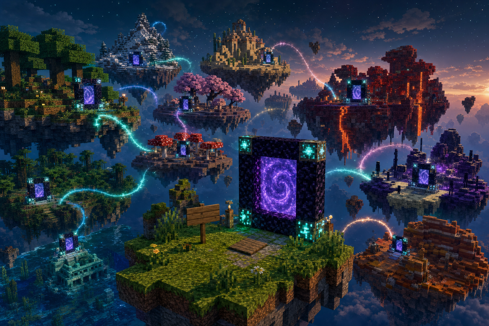

<h1 align="center">Multiverse Portals</h1>

<p align="center">
  <strong>Много серверов.<br>Одна сеть порталов.</strong>
</p>

<p align="center">
  <a href="https://mp.mvse.ws/"><strong>Сайт и jar → mp.mvse.ws</strong></a><br>
  <a href="https://hangar.papermc.io/mvse/MultiversePortals">Hangar</a> ·
  <a href="https://modrinth.com/project/multiverseportals">Modrinth</a> ·
  <a href="https://www.curseforge.com/minecraft/bukkit-plugins/multiverse-portals-mvse">CurseForge</a> ·
  <a href="https://github.com/mvsews/MultiversePortals/releases">GitHub</a>
</p>

<p align="center">
  <a href="README.md">English</a> ·
  <a href="README.ru.md">Русский</a> ·
  <a href="README.zh.md">简体中文</a> ·
  <a href="portal_guide.md">Гайд игрока</a> ·
  <a href="docs/TECHNICAL.md">Техническое</a>
</p>

---

## Что это?

Плагин для **Paper 1.21+**, который связывает независимые Minecraft-серверы порталами — **без Bungee и Velocity**.

Игроки строят портал из **таблички + рамки**. Нажимная плита не обязательна. Игра использует ванильный пакет **Transfer** (и Geyser для Bedrock). Мир может и отпускать игроков, и принимать гостей из публичной сети.

**Что умеет:**

- Переходы между **независимыми Paper-серверами** без прокси
- Случайный **`[Multi]`** — находит живой мир и закрепляется за ним
- Портал **`[To]`** на конкретный IP или сервер, **`[Pair]`** — туда-обратно между своими мирами
- **Away** — в другой биом верхнего мира (как адский портал: рамка из дерева/песка/льда этого биома)
- **Шерстяные порталы** на этом же сервере (цвет + канал, как ColorPortals; любое замкнутое кольцо одного цвета)
- Заполнение **замкнутой рамки любого размера** ванильной текстурой портала в Ад (плотный ряд с общей колонкой — отдельные порталы)
- Игроки с **Bedrock** через Geyser
- Если на той стороне нет обратного портала — случайный местный портал час ведёт **домой**
- Строить могут **все** или **только админы**; каждый тип порталов можно выключить в конфиге

**Язык в игре:** `/mvp lang en|de|ru|zh` · [Changelog](CHANGELOG.md)

---

<p align="center">
  
</p>

<p align="center">
  <a href="https://mp.mvse.ws/"></a><br>
  <a href="https://mp.mvse.ws/"></a>
  <a href="https://mp.mvse.ws/"></a>
</p>

<p align="center">
  <a href="https://hangar.papermc.io/mvse/MultiversePortals"></a>
  <a href="https://modrinth.com/project/multiverseportals"></a>
  <a href="https://www.curseforge.com/minecraft/bukkit-plugins/multiverse-portals-mvse"></a>
  <a href="https://github.com/mvsews/MultiversePortals/releases"></a>
</p>

## Установка за 5 минут (свой Paper)

Сервер должен быть на **Paper 1.21+** (обычный Vanilla не подойдёт). Если Paper ещё нет — скачай здесь: [papermc.io/downloads/paper](https://papermc.io/downloads/paper), положи `paper.jar` в папку сервера и один раз запусти (создадутся `server.properties`, мир и папка `plugins`).

1. **Скачай плагин** с [mp.mvse.ws](https://mp.mvse.ws/) — файл вида `MultiversePortals-….jar` (на сайте кнопка скачивания).
2. **Положи jar в папку `plugins`** рядом с `paper.jar` (если папки нет — создай):
   ```text
   my-server/
     paper.jar
     server.properties
     plugins/
       MultiversePortals.jar   ← сюда
   ```
3. Открой **`server.properties` в корне сервера** (не внутри `plugins`) и убедись, что есть строка:
   ```properties
   accept-transfers=true
   ```
   Без неё другие миры не смогут присылать к тебе игроков. При первом запуске плагин часто дописывает это сам — но после правки всё равно нужен полный перезапуск.
4. **Полностью останови сервер и запусти снова**, чтобы плагин загрузился.
5. Зайди в игру и напиши **`/mvp settings`** — там видно адрес сервера и, видит ли тебя публичная карта.

Адрес для карты и Transfer берётся из `server-ip` / `server-port` в том же `server.properties`. Менять что-то в `plugins/MultiversePortals/config.yml` нужно только если друзья заходят к тебе **по другому домену или порту** (NAT, прокси, Docker с пробросом портов):

```yaml
server:
  public-host: "play.example.com"   # пусто = как server-ip
  public-port: 25566                # 0 = как server-port; иначе порт, который реально набирают игроки
```

**Когда сервер не появится на [mp.mvse.ws](https://mp.mvse.ws/):** закрытый LAN, приватный IP, выключенный `accept-transfers`, или снаружи указан неверный порт. Это нормально для домашней игры — порталы между своими мирами всё равно работают. Чтобы сознательно не светиться на карте: в `config.yml` поставь `server.list-publicly: never`.

---

## Установка за 1 минуту (Docker)

Если Paper ещё нет и на машине есть **Docker на Linux**, можно поднять готовый мир одной командой: Paper + Multiverse Portals + Geyser (телефон / консоль) + ViaVersion. Используется `--network host` — порты слушаются прямо на хосте: Java **25565**, Bedrock **19132**.

```bash
docker run -d --name minecraft_mvp --network host -e EULA=TRUE -v mvp-data:/data mvsews/mvp && IP=$(curl -fsS https://api.ipify.org) && echo "Server ready — connect Java $IP:25565 | Bedrock $IP:19132"
```

После первого запуска подожди пару минут (скачивается Paper и генерируется мир). В конце команда напечатает IP, по которому заходить. Имя сервера, если не задать, выберется само (например, «Peppery Bridge»). При каждом **старте/рестарте контейнера** качаются свежие **Geyser, Floodgate, ViaVersion, ViaBackwards, ViaRewind** (старые Java-клиенты) и **MultiversePortals**, если на https://mp.mvse.ws/version.json версия новее (`-e UPDATE_BEDROCK_BRIDGE=false` / `-e UPDATE_MVP=false` чтобы не трогать).

**Полезные переменные** — добавляй рядом с `-e EULA=TRUE`:

| Переменная | По умолчанию | Зачем |
|------------|--------------|--------|
| `SERVER_NAME` | забавное авто-имя | название в MOTD и на карте |
| `MOTD` | как `SERVER_NAME` | то же, если хочешь отдельно |
| `PUBLIC_HOST` | внешний IP (ipify) | домен или IP, который видят другие серверы / карта |
| `PUBLIC_PORT` | `25565` | Java-порт для игроков |
| `BEDROCK_PORT` | `19132` | UDP-порт Geyser |
| `MEMORY` | `1G` | память JVM, например `-e MEMORY=2G` |
| `FLOODGATE_KEY_B64` | (нет) | общий Floodgate `key.pem` в base64 — если Bedrock-игроки прыгают между «своими» серверами |
| `UPDATE_BEDROCK_BRIDGE` | `true` | при старте обновить Geyser / Floodgate / ViaVersion / ViaBackwards / ViaRewind |
| `UPDATE_MVP` | `true` | при старте заменить MultiversePortals, если на сайте версия новее |

Пример со своим именем и доменом:

```bash
docker run -d --name minecraft_mvp --network host \
  -e EULA=TRUE \
  -e SERVER_NAME="Rainbow Forest" \
  -e PUBLIC_HOST=play.example.com \
  -v mvp-data:/data \
  mvsews/mvp
```

Мир и данные лежат в Docker-томе `mvp-data` — контейнер можно пересоздавать, сохранения останутся. Логи: `docker logs -f minecraft_mvp`. Остановить: `docker stop minecraft_mvp`.

---

## Типы порталов (таблички)

Первая строка таблички = тип. Настенную табличку вешай на **правую стойку** (если смотреть на портал). Зайди в проём (плита по желанию).

| Пишешь | Что происходит |
|--------|----------------|
| `[Multi]` / `[portal]` / `Портал` / `传送门` | Один раз находит живой сервер и **держится** за него, пока не сломаешь табличку |
| `[To]` / `К` / `前往` + IP | Всегда идёт на этот адрес |
| `[Pair]` / `Пара` / `配对` | Создаёт код — тот же код на другом сервере = туда-обратно |
| `Portal` / `Портал` на **блоке этого биома** (2-я пустая / `Away`) | Другой биом верхнего мира на **этом** сервере (связь как у портала в Ад) |

Скобки `[]` / `【】` и регистр не важны. На 1-й строке (и на 2-й под `Portal` / `Портал`) срабатывают одни и те же слова:

| Тип | EN | RU | ZH |
|-----|----|----|-----|
| Multi | `Portal` `Multi` `Random` `MVP` | `Портал` `Мульти` `Случайный` `Рандом` | `传送门` `随机` |
| Away | `Away` | `Авей` `Биом` | `异界` `群系` |
| To | `To` `Goto` `Server` | `К` `На` `Сервер` | `前往` `到` |
| Pair | `Pair` `Link` | `Пара` `Связь` | `配对` |

**Ручка:** кнопка у случайного `[Multi]` перебиндивает цель (сначала пиры клуба MVP). Не работает на `[To]` / `[Pair]`.

Статус на табличке: `Portal` → `Finding a world...` → короткое имя цели + `->` (односторонний) или `<->` (пара).

Для публичных односторонних прыжков игроки один раз пишут **`/mvp ready`**.

---

## Связать два своих сервера (туда-обратно)

Лучший вариант: **`[Pair]`**.

**Сервер A**

1. Рамка + табличка (плита по желанию)  
2. Строка 1: `[Pair]` (строка 2 пустая)  
3. Скопируй **код** из чата / с таблички  

**Сервер B**

1. То же самое  
2. Строка 1: `[Pair]`  
3. Строка 2: этот **код**  

Когда с обеих сторон `<->`, наступил на любую сторону — попадаешь к другому порталу и можешь вернуться.

На обоих серверах нужны `accept-transfers=true` и реальный `public-host`. В одну сеть они попадают через [mp.mvse.ws](https://mp.mvse.ws/).

<details>
<summary>Альтернатива: IP на табличке</summary>

| Строка | Текст |
|--------|-------|
| 1 | `Portal` |
| 2 | `1.2.3.4:25565` |

Или только адрес во 2-й строке, если порт по умолчанию `25565`. Старый вариант: хост во 2-й, порт в 3-й — тоже работает. Для настоящего туда-обратно на другой стороне тоже нужен обратный портал.
</details>

---

## Away (другой биом, тот же сервер)

Как портал в Ад, но между **биомами верхнего мира** на этом сервере.

1. Замкнутая рамка из **блока этого биома** (дуб в лесу, песчаник в пустыне, плотный лёд на леднике, …). Любой размер; табличка на **правой стойке**
2. Строка 1 = `Portal` / `Портал`. Строка 2 пустая или `Away` / `Авей`
3. Зайди в фиолетовый проём — первый проход привязывает к одному биому (океан и пещеры тоже; Ад и Край нет) и держит связь

Плагин может сам поставить маленькую обратную рамку из материала **твоего** биома, табличка справа. Если рамка из не того блока — в чате напишет, какой нужен здесь. `Random` на 2-й строке — всё равно **межсерверный** портал, даже на дубе. Away **не** показывается на публичной карте.

---

## Локальные порталы (тот же сервер)

Рамка из шерсти + настенная табличка (как ColorPortals):

1. Замкнутое кольцо **шерсти одного цвета** (любой размер; дверь 3×4 — обычный маленький вариант), табличка на **правой стойке**  
2. Строка 1 = **имя**, строка 2 = **канал** (`0`–`9999`)  
3. Зайди в фиолетовый проём — тот же цвет + канал = кольцо варпов на **этом** сервере  

`/mvp local list` · админы могут импортировать старые ColorPortals: `/mvp local import-colorportals`.

---

## Полезные команды

| Команда | Для чего |
|---------|----------|
| `/mvp version` | Установленная vs свежая на mp.mvse.ws |
| `/mvp ready` | Разрешить публичные односторонние переходы |
| `/mvp lang …` | Язык интерфейса (fallback сервера) |
| `/mvp settings` | Карта, гости, инвентарь, кто создаёт, типы порталов |
| `/mvp help` | Справка в игре |
| `/mvp update` | Скачать обновление jar (админ) |
| `/mvp scanner` | Статус публичного пула (админ) |

**Инвентарь:** по умолчанию не переносится. Включить: `/mvp settings export on` / `import on` (или `/mvp items …`).

---

## Документация

| Документ | Для кого |
|----------|----------|
| **[portal_guide.md](portal_guide.md)** | Игроки (RU) |
| **[portal_guide.en.md](portal_guide.en.md)** | Игроки (EN) |
| **[portal_guide.zh.md](portal_guide.zh.md)** | Игроки (中文) |
| **[docs/TECHNICAL.md](docs/TECHNICAL.md)** | Конфиг, производительность, сканеры, сборка |
| **[docs/SCANNERS.md](docs/SCANNERS.md)** | Публичные сканеры для `[Multi]` · сотрудничество |
| **[docs/REGISTRY.md](docs/REGISTRY.md)** | Публичный каталог (HTTPS) · только хаб |
| **[CHANGELOG.md](CHANGELOG.md)** | Что нового в релизах |
| **[docs/GROWTH.md](docs/GROWTH.md)** | Тихий сервер: приток игроков, плюсы и минусы (EN/RU/DE) |
| **[docs/CONCEPTS.md](docs/CONCEPTS.md)** | Задуманное поведение (рамки, Away, дом, типы) |
| **[docs/ARCHITECTURE.md](docs/ARCHITECTURE.md)** | Как устроены части |

---

## Обратная связь

Если в игре поведение **не совпадает** с тем, что написано в этом README или в **[docs/CONCEPTS.md](docs/CONCEPTS.md)** (и остальных docs), открой **[Issue](https://github.com/mvsews/MultiversePortals/issues/new/choose)** или **[Pull Request](https://github.com/mvsews/MultiversePortals/pulls)**. И то и другое **приветствуется** — так заявленное поведение остаётся честным.

Идеи и фичи — тем же путём.

---

## Лицензия

**MIT** — можно использовать, распространять и менять. См. [LICENSE](LICENSE).

---

<p align="center">
  <sub>Нужны игроки? <a href="docs/GROWTH.md">docs/GROWTH.md</a> — Transfer, гости, карта; <code>create: admin</code>, если не хочешь утечку своего онлайна.</sub>
</p>
